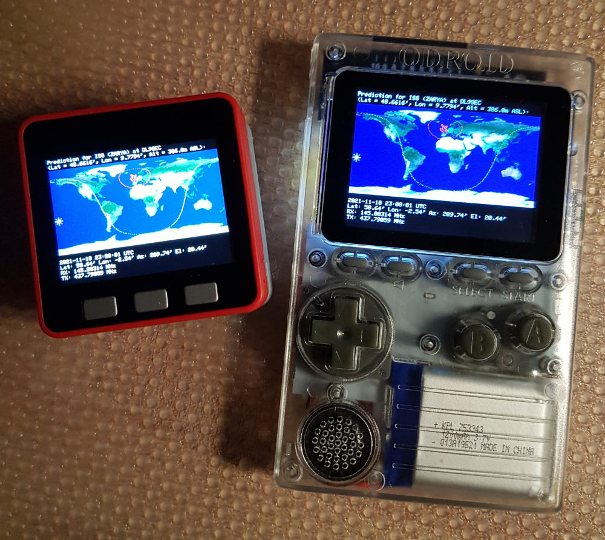
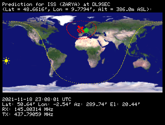

# AioP13
"**A**nother **i**mplementation **o**f **P**LAN-**13**" library, originally ported by Mark VandeWettering K6HX (https://github.com/brainwagon/angst/tree/master/P13) from the BASIC implementation "PLAN-13" of J.R. Miller G3RUH (http://www.amsat.org/amsat/articles/g3ruh/111.html). Compact and modular port to smaller processors including the Atmel AVR chips and reworked for flawless library use in the Arduino ecosystem.

(I renamed the whole stuff from formerly ArduinoP13 to AioP13 to follow the "Arduino Library Specifications" for naming of libraries. There also was a complete rework nescessary because of a variable name conflict with one of the latest ESP32 core libraries, so all variables got a qualifier to get more or less unique names. In some cases this is very ugly, so all the variables should be renamed to speaking and useful names in one of the next releases. But all seems to work fine so far, including Uwe Nagel's implementation for the suns elevetion and azimuth calculations, thanks again!)

Tested with M5Stack Core Basic, ODROID-GO and Arduino UNO.

# Examples
## PredictISS
A prediction example for the ISS with output to the console (ESP32 and Arduino UNO).

## PredictISS_TFT
A simple prediction example (nothing moving or dynamic, just a snapshot for a specific date/time) based on "PredictISS" for the ISS on an ESP32 with output to a TFT (M5Stack, ODROID-GO and others) using the ["ESP32-Chimera-Core" by tobozo](https://github.com/tobozo/ESP32-Chimera-Core) as a multi-platform alternative to the original M5Stack library.

## PredictAnalemma_TFT
A simple [Analemma](https://en.wikipedia.org/wiki/Analemma) prediction example (nothing moving or dynamic) on an ESP32 with output to a TFT (M5Stack, ODROID-GO and others) using the ["ESP32-Chimera-Core" by tobozo](https://github.com/tobozo/ESP32-Chimera-Core) as a multi-platform alternative to the original M5Stack library for checking the prediction algorithm for the sun.

 
